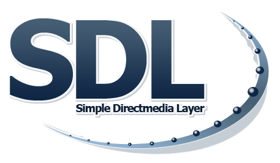

  

     
 

# SDL3
### Simple DirectMedia Layer for Delphi

Pascal bindings that allow you to use **SDL3** and other useful libraries with <a href="https://www.embarcadero.com/es/products/delphi" target="_blank">Delphi</a>. 

### Included
- **SDL3** (https://github.com/libsdl-org/SDL)
- **miniaudio** (https://github.com/mackron/miniaudio)
- **pl_mpeg** (https://github.com/phoboslab/pl_mpeg)
- **Nuklear** (https://github.com/Immediate-Mode-UI/Nuklear)
- **stb** (https://github.com/nothings/stb)

### Minimum Requirements 
- Windows 10+ (64 bits)
- Delphi/FreePascal that can target Win64/Unicode

### Usage
You simply add `SDL3` to your uses section and everything will be linked in your executable **(~2MB overhead)**, ready for use with no DLLs to maintain. You will have direct access to all the aforementioned libraries. :cool:  

*Visit the repo links for more information/documentation about the libraries used.* 

### Support
- <a href="https://github.com/tinyBigGAMES/SDL3/issues" target="_blank">Issues</a>
- <a href="https://tinybiggames.com/contact/" target="_blank">Contact</a>
- <a href="https://libsdl.org/" target="_blank">SDL Homepage</a>
- <a href="https://discourse.libsdl.org/" target="_blank">SDL Forums</a>
- <a href="https://wiki.libsdl.org/SDL3/FrontPage/" target="_blank">SDL Wiki</a>

 
   
 ♥ <b>Made for Pascal</b>

